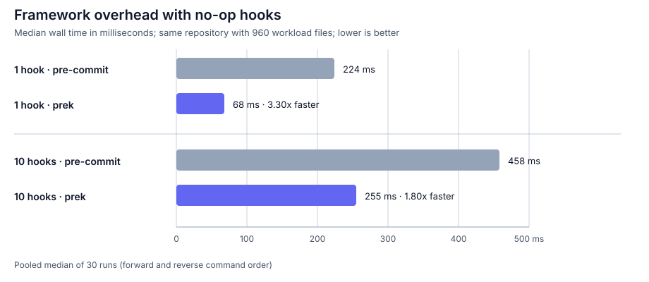
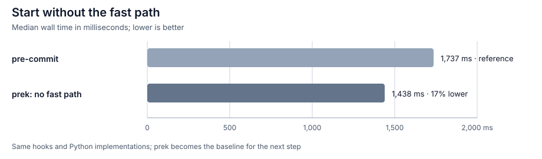
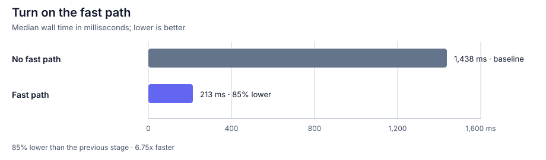
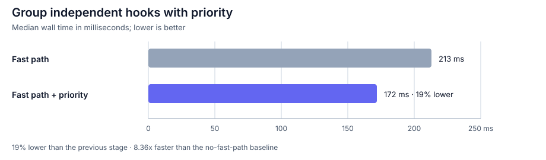
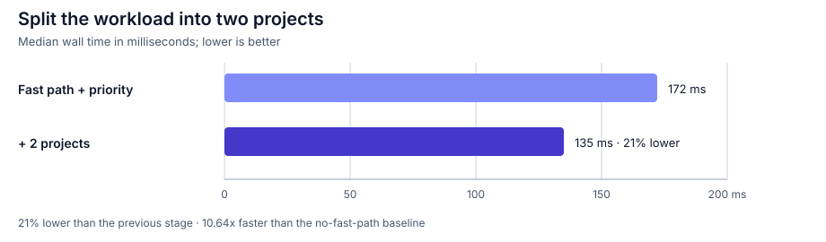
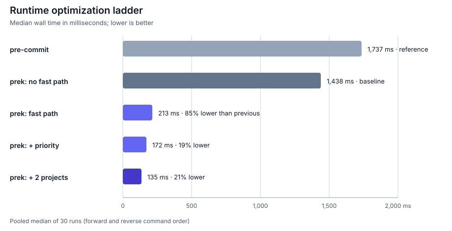

# Benchmarks

"How much faster is prek?" sounds like a question that should have one simple
answer. In practice, it depends on where the time goes.

Some of that time belongs to the hook itself: a formatter reads files, a linter
builds an analysis, or `cargo clippy` compiles a crate. The rest belongs to the
runner around it. prek and pre-commit still need to load configuration, ask Git
which files matter, match those files to hooks, start processes, present the
results, and determine whether anything changed.

That distinction is the key to reading these numbers. If `cargo clippy` takes
30 seconds, even cutting everything around it from roughly 1.4 seconds to 0.1
seconds only changes the total from 31.4 seconds to 30.1 seconds: about a 1.04x
speedup. At the other extreme, a repository with many quick hooks can spend most
of its time inside the runner, especially when checking the worktree with
`git diff` is expensive.

Rather than jumping straight to one headline number, we will build the picture
from the smallest workload upward. First we will make the hook almost free and
compare the frameworks themselves. Then we will bring back real hooks and add
prek's fast path, priority scheduling, and project-level concurrency one step at
a time.

## Start with the framework

The simplest way to expose framework cost is to make the hook do almost
nothing. Here every hook is a local `language: system` hook whose entry is
`true`. `always_run: true` and `pass_filenames: false` ensure that every hook
runs exactly once with the same tiny payload:

```yaml
repos:
  - repo: local
    hooks:
      - id: noop-01
        name: no-op 01
        entry: "true"
        language: system
        always_run: true
        pass_filenames: false
```

The full configuration repeats this definition with unique IDs through
`noop-10`. Both measurements load that same configuration; the one-hook case
selects only `noop-01`, while the ten-hook case runs all hooks sequentially.
These are generic hooks, so prek's built-in fast path is not involved.



This is still not a measurement of literally zero hook cost: the runner must
launch a child process for every `true`. The one-hook case mostly exposes fixed
startup and repository-processing costs. With ten hooks, both runners repeat
dispatch and modification checks; prek saves 203 ms in absolute time, while the
relative gap narrows from 3.30x to 1.80x.

That gives us a useful lower bound, but not yet a representative hook workload.
The next question is what happens when the hooks perform real, predictable work
and prek can apply its own runtime optimizations.

## Add optimizations one at a time

Now we replace `true` with 13 unique hooks from
[`pre-commit-hooks`](https://github.com/pre-commit/pre-commit-hooks). The
medium-scale corpus remains the same: 960 workload files, a clean worktree, and
warm hook environments and filesystem caches. Installation and network time
are not included.

To make each change visible, we begin with prek's fast path disabled and add one
optimization at a time. Each stage keeps the improvements introduced before it,
and we will look at its result before moving on to the next one.

### 1. No fast path

We first set `PREK_NO_FAST_PATH=1`, so prek runs the original Python hook
implementations. The hooks keep their implicit priorities and run sequentially.
This gives us a baseline before enabling any prek-specific runtime
optimizations.

The `pre-commit` reference takes 1,737 ms. prek completes the same workload in
1,438 ms, 17% less time. We use that 1,438 ms result as the baseline for the
remaining stages.



### 2. Fast path

Next, we remove `PREK_NO_FAST_PATH` without changing the hook configuration.
prek's [automatic fast path](builtin.md#1-automatic-fast-path) recognizes the
13 hooks and runs their built-in Rust implementations. The median falls from
1,438 ms to 213 ms: 85% less time, or a 6.75x speedup.



This benchmark deliberately uses hooks for which prek has built-in
implementations. That keeps the execution path predictable, but it also makes
the fast path unusually visible. Treat this result as an explanation of where
time can be removed, not as a promise for every workload.

### 3. Priority

The fast path is automatic when a supported hook matches. Priority requires a
little more information: you need to tell prek which hooks are independent and
can safely run together.

Hooks with the same [`priority`](reference/configuration.md#priority) may run at
the same time. Only group hooks that are independent. In the benchmark, hooks
which can modify overlapping text files remain ordered, and read-only checks
share a named priority. This excerpt shows the grouping:

```yaml
priorities:
  trim: 0
  eof: 10
  line-endings: 20
  bom: 30
  checks: 40

repos:
  - repo: https://github.com/pre-commit/pre-commit-hooks
    rev: v6.0.0
    hooks:
      - id: trailing-whitespace
        priority: trim
      - id: end-of-file-fixer
        priority: eof
      - id: mixed-line-ending
        priority: line-endings
      - id: fix-byte-order-marker
        priority: bom
      - id: check-json
        priority: checks
      - id: check-yaml
        priority: checks
      - id: check-toml
        priority: checks
      - id: check-xml
        priority: checks
```

With the fast path retained, priority scheduling lowers the median from 213 ms
to 172 ms, another 19% reduction. That is 8.36x faster than the no-fast-path
baseline.



### 4. Two projects

Priority scheduling shortens the critical path inside one project. The final
stage applies the same idea one level higher by splitting structured data and
text files into two sibling projects:

```text
benchmark-repo/
├── .pre-commit-config.yaml
├── structured/
│   └── .pre-commit-config.yaml
└── text/
    └── .pre-commit-config.yaml
```

Each project declares only the hooks it owns. Common checks appear in both
project configurations, but they see disjoint sets of files. This models a
configured monorepo rather than duplicating every hook in every project just to
exercise the scheduler.

[Projects at the same depth](workspace.md#execution-order) can run concurrently.
Nested parent and child projects still run from deepest to shallowest, so a
workspace should reflect real ownership boundaries rather than being split only
to chase a benchmark number.

Adding the second project lowers the median from 172 ms to 135 ms, another 21%
reduction.



### Summary

Put together, the four measurements form the complete optimization ladder:



Across the complete ladder, prek falls from 1,438 ms to 135 ms: 90.6% less
time, or a 10.64x speedup. The final configuration is 12.85x faster than the
`pre-commit` reference.

## The hidden cost of `git diff`

The large fast-path jump is not only about replacing Python hook
implementations with Rust. It also removes work around the hooks.

An arbitrary hook can modify files without reporting that fact, so a hook
manager needs another way to decide whether the worktree changed. That check is
often `git diff`, and it can be a substantial part of framework time when a
repository contains many files.

In the versions measured here, `pre-commit` captures one diff before running the
hooks and another after every hook that executes. Thirteen executed hooks can
therefore require 14 diffs. prek also uses diffs when a general hook's mutation
status is unknown, but its built-in and automatic fast-path hooks report whether
they changed files. When every result is known, prek can skip those diffs
entirely.

This fixture is deliberately moderate: a separate 30-run check of a clean
`git diff` had a median of about 18 ms. The difference becomes much larger in an
extreme repository where one diff takes hundreds of milliseconds. For example,
at 300 ms per diff:

| Execution path | Diff calls for 13 hooks | Diff time alone |
| -- | -: | -: |
| `pre-commit` | 14 | about 4.2 s |
| prek, all results known | 0 | 0 s |

This is an illustration of diff overhead, not a claim that the hooks themselves
take zero time. If even one hook has an unknown mutation outcome, prek still
performs the required check rather than assuming the worktree is unchanged.

## What this means for a real repository

At this point, two different kinds of speedup should be visible. Framework
savings remove time around each hook, while concurrency shortens the critical
path through the hooks themselves:

- A single slow hook hides framework improvements. The total cannot become much
  faster than that hook.
- Correct priority groups shorten the critical path. Three independent 20-second
  hooks can approach 20 seconds instead of 60 seconds when resources allow.
- Independent same-depth projects can make the same improvement across a
  monorepo. Each project advances through its own priority groups without
  waiting for an unrelated sibling project.

Well-configured priority and project concurrency can therefore produce
multi-fold improvements even when fast-path savings are small. Actual scaling
is bounded by CPU, memory, disk and cache contention, and by
[`PREK_CONCURRENT_HOOKS`](reference/environment-variables.md#prek_concurrent_hooks).
Do not run hooks concurrently when they modify the same files or share mutable
global state.

## Reproduce the benchmark

The complete fixture generator, pinned hook configurations, hyperfine commands,
and raw samples are published in
[`prek-ci/benchmarks`](https://github.com/prek-ci/benchmarks).
The generator recreates all three fixture layouts and verifies their Git tree
hashes, so a change to any workload file is detected before measurements begin.

With Git, uv, hyperfine, and Python 3 installed, run:

```console
git clone https://github.com/prek-ci/benchmarks.git
cd benchmarks
./scripts/setup-tools.sh
./benchmark.sh
```

`setup-tools.sh` installs the prek 0.4.12 binary wheel and pre-commit 4.6.1 in
isolated tool environments using Python 3.14.6. `benchmark.sh` creates a fresh
960-file fixture, warms both runner caches, executes the framework,
runtime-ladder, and clean-`git diff` benchmarks in both command orders, and
writes the raw JSON plus a pooled-median summary to
`results/local-<timestamp>/`.

The [original 2026-07-31 samples](https://github.com/prek-ci/benchmarks/tree/main/results/2026-07-31)
are preserved alongside the scripts. Expect absolute times to vary across
machines; compare the ordering and relative changes on your own hardware.

## Methodology

- Date: 2026-07-31
- OS: macOS 15.7.7
- CPU: Apple M3 Pro, 12 cores
- RAM: 18 GiB
- prek: `0.4.12`
- pre-commit: `4.6.1`
- pre-commit-hooks: `v6.0.0`
- hyperfine: `1.20.0`
- Framework workload: 960 workload files; 10 local `language: system` hooks
  invoking `true`; `always_run: true`; `pass_filenames: false`; one or ten hooks
  selected; clean worktree and warm filesystem caches
- Optimization workload: the same 960 files; configuration files excluded from
  hook matching; 13 unique built-in-capable hook IDs; clean worktree; warm hook
  environments and filesystem caches
- Sampling: 5 warmups followed by 15 measured runs in forward order and 15 in
  reverse order; the charts report the pooled median of 30 runs

Benchmark performance varies with hardware, operating system, repository shape,
hook configuration, cache state, and background load. Compare representative
end-to-end workloads on your own machine before making configuration decisions.
