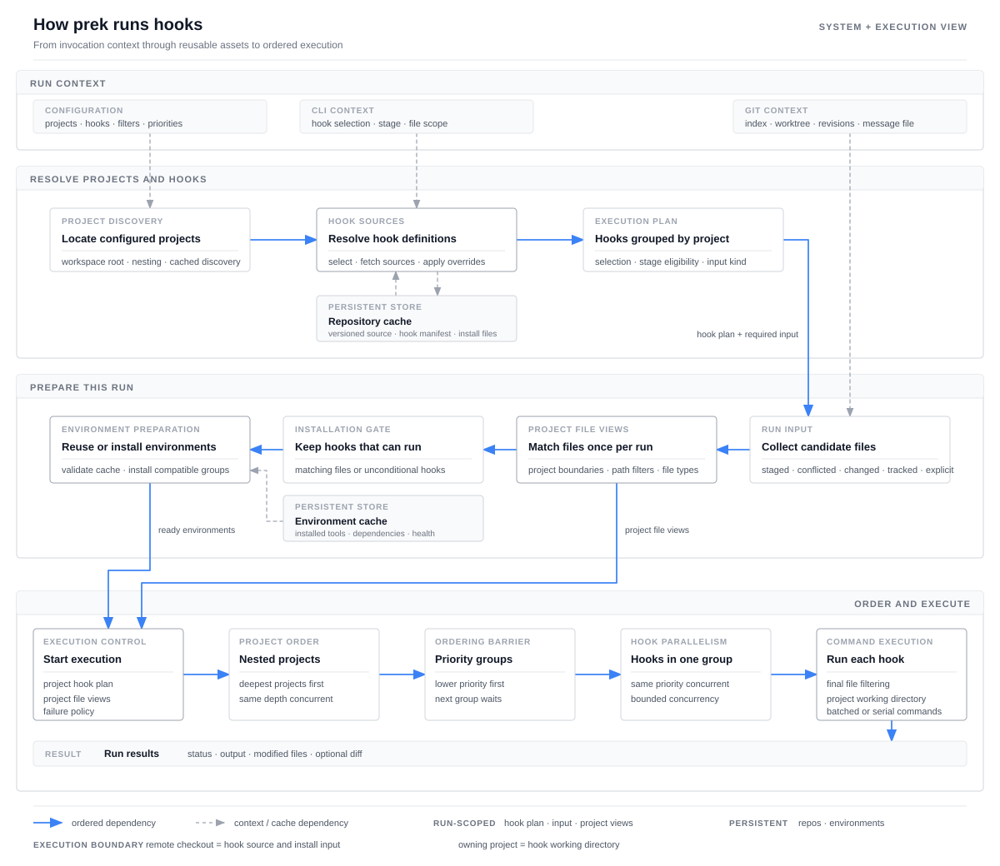

# Internals

This page explains how prek works beneath its CLI and configuration.

## Architecture overview

`prek run` coordinates configuration, Git state, downloaded hook sources, and
reusable tool environments. Each invocation follows four phases: resolve the
work to do, collect its input, prepare the required environments, and execute
the hooks under deterministic scheduling rules. Most state exists only for the
current run; downloaded repositories and installed environments are retained
for later runs.



Solid blue arrows show the ordered path through a run. Dashed gray arrows show
context or cache access. The execution layer is expanded because project
nesting, priority barriers, hook concurrency, and command batching all affect
observable behavior.

One ordering detail is important: remote hook repositories are resolved before
file collection. Their manifests can affect which hooks exist and whether the
selected stage expects normal files, a Git message file, or no files. A remote
checkout supplies hook code and installation input, but hooks still run from
the project that uses them.

### 1. Resolve projects and hooks

prek first locates the workspace and its configured projects, including nested
projects. It combines the command-line selection, configured groups, and the
current Git hook stage to determine which hook definitions are relevant.

Remote repositories are deduplicated and resolved once. Existing versioned
checkouts are reused, while missing ones can be fetched concurrently. Local and
built-in hooks do not need a separate checkout.

Once every source is available, prek combines each manifest with the project's
overrides. The result is a run plan grouped by project, together with the kind
of input required by the selected stage.

### 2. Collect and organize the run input

Depending on the stage and command-line options, prek collects one of the
following inputs:

- staged or conflicted files for the default pre-commit path;
- files changed between two revisions;
- all Git-tracked files;
- explicitly named files, directories, or globs;
- a Git message file for message stages, or an empty file list for stages that
  do not receive files.

Normal file paths are made relative to the workspace root. prek then constructs
the file view for every project once. This step respects nested project
boundaries, project-level include and exclude rules, and boundaries that stop a
child project's files from also being assigned to its ancestors. File types are
also determined once. Environment preparation and hook execution share these
views instead of repeating the same project-by-file scan.

### 3. Prepare hook environments

Before consulting the environment cache, prek removes environment-backed hooks
that cannot run for the current input. Hooks that are configured to run
regardless of their input remain eligible. Hooks that use built-in or system
tools do not need an installed environment.

For the remaining hooks, prek reuses healthy environments and installs only
what is missing. Compatible installations are grouped by runtime, hook source,
and dependencies. Independent groups can be prepared concurrently, while work
inside one group remains ordered so compatible hooks can reuse the same
environment.

### 4. Schedule and run hooks

Nested projects are processed from the deepest level outward. Projects at the
same depth can run concurrently. Within a project, lower priority values run
first; hooks with the same priority can run concurrently, and the next priority
group waits for the current group to finish. Each priority group is therefore a
barrier: later hooks see file changes made by earlier groups.

Immediately before a hook runs, its own path and file-type filters narrow the
project input. Hooks with no matching files are skipped unless they are
configured to run unconditionally. A command may receive filenames in multiple
batches to stay within the platform's argument limit, while hooks that require
serial execution process those batches one at a time.

Every hook runs from the project that owns it, including hooks whose code came
from a remote repository. prek records output, exit status, and file changes.
The configured failure policy determines whether later work proceeds, and the
final result can include a diff of detected modifications.

### What persists between runs

| State | Lifetime | Purpose |
| -- | -- | -- |
| Project and hook plan | Current run | Resolved project structure, selected hooks, and scheduling information |
| Selected input and project file views | Current run | Candidate files, project-relative paths, and file types |
| Repository cache | Across runs | Remote hook checkouts pinned to configured versions |
| Environment cache | Across runs | Installed tool environments and the metadata needed to validate them |

## Hook entry resolution

If you are configuring an existing project command rather than studying the
execution model, start with [Run Existing Project Commands](local-hooks.md).

`repo` and `language` control different parts of hook execution:

- `repo` determines where the hook source comes from.
- `language` determines how the hook is installed and what `entry` means.

The hook checkout does not become the working directory. Hooks run against the
project being checked, including hooks loaded from a remote repository.

| Configuration | Hook source | Working directory |
| -- | -- | -- |
| `repo: local` | The project itself; there is no separate hook checkout. | The project directory. |
| `repo: <URL or path>` | A checkout cached by prek at the configured `rev`. | The project that uses the hook. |

### Direct command entries

For command-style languages such as `system`, `mise`, `python`, and `node`, prek
splits `entry` into arguments and invokes it directly. A shell is not involved:
shell operators such as `|`, `&&`, `$VAR`, and `*` are not interpreted. Use the
prek-only [`shell`](reference/configuration.md#shell) option when shell syntax is
required.

A bare command such as `ruff` is looked up on the `PATH` prepared by the language.
An explicit relative path such as `./scripts/check.sh` is resolved from the hook's
working directory. For a remote command-style hook, that means the end user's
project, not the cached hook checkout. For `repo: local`, it naturally refers to
the project that defines the hook.

Hook `args` are appended after the arguments from `entry`, followed by matching
filenames when `pass_filenames` allows them. See
[Passing arguments to hooks](authoring-hooks.md#passing-arguments-to-hooks) for
an example.

### Language-specific meanings

Most languages use the direct command rules above, with their installed tools
available on `PATH`. When `shell` is omitted, some backends intentionally give
`entry` a more specific meaning:

| Language | Meaning of `entry` |
| -- | -- |
| [`script`](languages.md#script) | The first argument is a script path. It is relative to the hook checkout for remote hooks and the project directory for local hooks. |
| [`julia`](languages.md#julia) | A Julia source path, relative to the hook checkout for remote hooks and the project directory for local hooks. |
| [`r`](languages.md#r) | `Rscript -e <expr>` or `Rscript <file>`; file paths use the same remote-checkout/local-project rule. |
| [`rust`](languages.md#rust) | The executable name; for a remote hook, it identifies a binary built and installed from the hook package. |
| [`docker`](languages.md#docker), [`docker_image`](languages.md#docker_image) | Container entrypoint, image, and argument information. The project is mounted as `/src` inside the container. |
| [`fail`](languages.md#fail), [`pygrep`](languages.md#pygrep) | A failure message or regular expression, not a command. |

The linked language sections describe the complete backend-specific behavior.

### Referencing files from the hook repository

`language: script` already resolves its script path from the remote hook checkout:

```yaml
- id: check
  name: Check files
  language: script
  entry: scripts/check.sh
```

For a command-style language, use the prek-only `{hook_repo}` placeholder when
the command or one of its arguments must refer to a file shipped in the hook
repository:

```yaml
- id: helm-lint
  name: Helm lint
  language: mise
  additional_dependencies: ["helm@4", "yq@4"]
  entry: "{hook_repo}/scripts/lint-helm-charts.sh"
```

```yaml
- id: check-config
  name: Check config
  language: system
  entry: tool --config "{hook_repo}/config/default.toml"
```

The placeholder is expanded independently inside each `entry` argument, after
command-line splitting. Quote an `entry` that begins with `{hook_repo}` so YAML
treats it as a string. For remote hooks it expands to the cached checkout; for
local hooks it expands to the project directory. It does not change the working
directory. Expansion applies only to direct command entries and `language: script`, not to `args`, filenames, `shell` source, or other backend-specific
entry forms.

!!! warning "pre-commit compatibility"

    Upstream `pre-commit` passes the placeholder through literally. Published hooks
    that depend on it should declare an appropriate `minimum_prek_version`.
